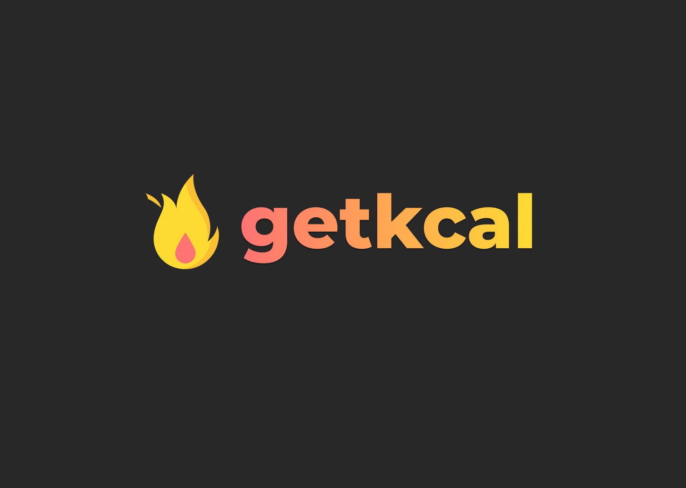

<p align="center">
  
</p>

<p align="center">
  
  
       

  
</p>

<h1 align="center">
    
</h1>

<br>

## 🧪 Technologies

This project was developed using the following technologies:

- [JavaScript](https://www.javascript.com/)

## 🚀 Getting started

Clone the project and access the folder.

```bash
$ git clone https://github.com/Gustavohsdp/getkcal.git
$ cd getkcal
```

Follow the steps below:
```bash
# initializing package.json
$ npm init -y

# installing serves as a development dependency
$ npm install serve -D

# Running node server
$ npx serve .
```
The app will be available for access on your browser at http://localhost:5000

## 🔖 Layout

You can view the project layout through the links below:

- [Layout](https://www.figma.com/file/LYks7H9gNGbQTtnSTOrZ9f/getkcal?node-id=0%3A1) 

Remembering that you need to have a [Figma](http://figma.com/) account to access it.

## 📝 License

This project is licensed under the MIT License. See the [LICENSE](LICENSE.md) file for details.


---

<p align="center">Made with 💜 by Gustavo Henrique</p>